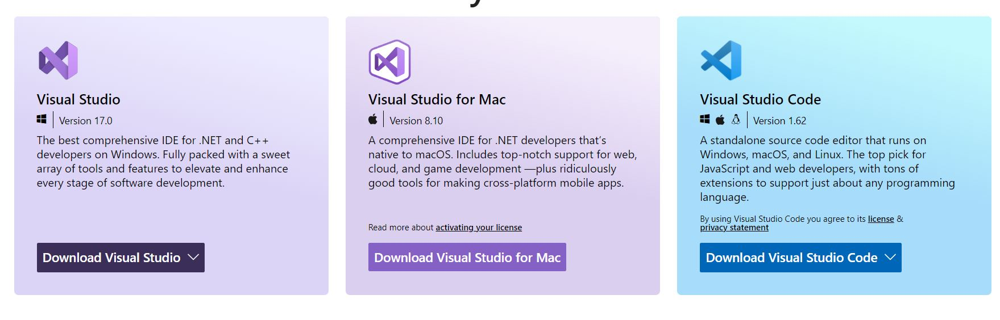
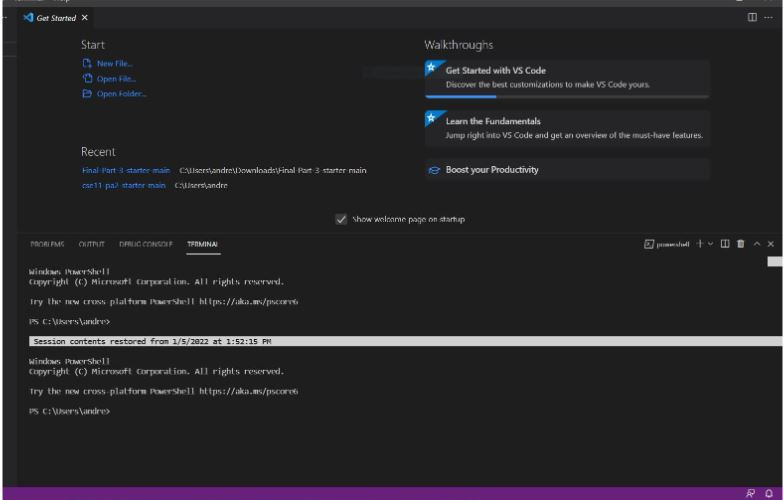
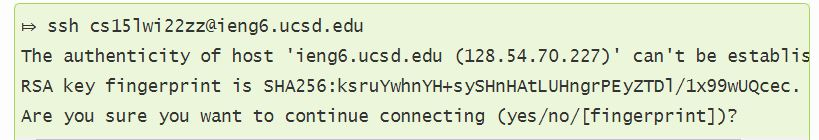
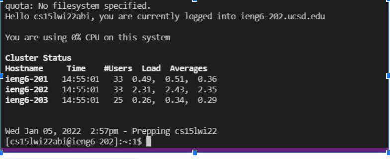
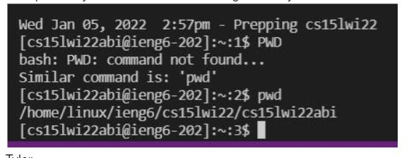

Step 1.Setting up Visual studios

* First you go to the official Visual Studios website 
* then either pick mac or windows version of Visual Studios depending on your preference
* Lastly once download it should open up and look the below screenshot when opened.

Step 2.Remotely Connecting
* First install OpenSSh if on windows
* Look up your couse specific account here in this link https://sdacs.ucsd.edu/~icc/index.php 
* Next open your terminal in VS code and paste in $ ssh course specific account + @ieng6.ucsd.edu
* Then the terminal ask to say yes or no such as the image below and in this case say yes

* Lastly put in your password and the page will look something like this after you have logged in
* 
Step 3. Trying Commands
* You can try some commands in the terminal such as PWD which will return your current working directory 

*There's other commands like ls which will list files/directories in the current directory and if you were to do it for the first time it would return perl5
*You can also lest to log off by ctrl-D or run the command exit in your terminal
