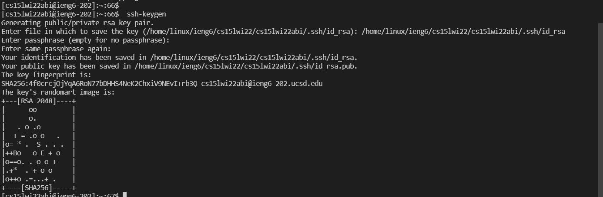
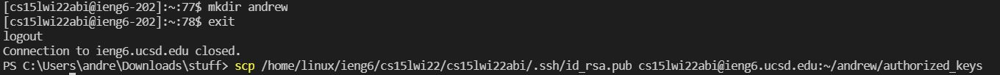
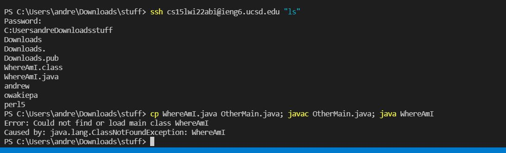
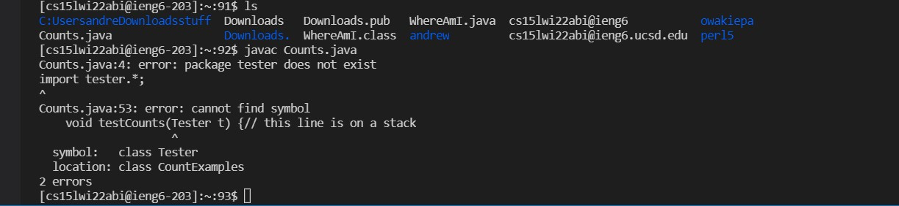

# Step 1.Setting up Visual studios

* First you go to the official Visual Studios website 
* then either pick mac or windows version of Visual Studios depending on your preference
* Lastly once download it should open up and look the below screenshot when opened.

# Step 2.Remotely Connecting
* First install OpenSSh if on windows
* Look up your couse specific account here in this link https://sdacs.ucsd.edu/~icc/index.php 
* Next open your terminal in VS code and paste in $ ssh course specific account + @ieng6.ucsd.edu
* Then the terminal ask to say yes or no such as the image below and in this case say yes

* Lastly put in your password and the page will look something like this after you have logged in
* 
# Step 3. Trying Commands
* You can try some commands in the terminal such as PWD which will return your current working directory 

*There's other commands like ls which will list files/directories in the current directory and if you were to do it for the first time it would return perl5
*You can also lest to log off by ctrl-D or run the command exit in your terminal

# Step 4. Moving Files
* First make a java file with any name, for this demonstration I will use WhereAmI.java with contents in it.
* Run the code with Javac and Java and check if it is working.
* next use the scp WhereAmI.java cs15lwi22zz@ieng6.ucsd.edu:~/ where the username can be replaceable with your student username and it should prompt you a password
* Lastly log into ieng6 with ssh again, and use ls and so you should see the file there in your home directory, now you can use javac and java when logged in.
 
# Step 5.Setting an SSH Key
* First go to terminal and paste ssh-keygen 
* Next it will ask for your key and so you paste your file
* when it ask for passphrase just press enter and it will allow you to move forward and your terminal should look like this

* Next type in mkdir .ssh and logoff 
* Now you can type your public key plus your username something like this scp /Users/joe/.ssh/id_rsa.pub cs15lwi22@ieng6.ucsd.edu:~/.ssh/authorized_keys and it will log you in
* 
# Step 6.Optimizing Remote Running
* Now try to do commands such as entering your username with a command such as ssh cs15lwi22abi@ieng6.ucsd.edu "ls"
* or try writing commands with semicolons which will do each step like  cp WhereAmI.java OtherMain.java; javac OtherMain.java; java WhereAmI

 Last example counts keystrokes and shows how to run remotely saving time
 
 
