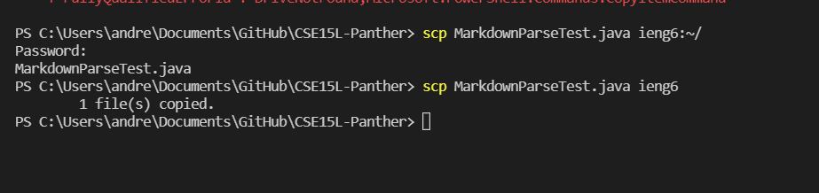

# Streamlining ssh Configuration

* In this picture I made the config and put my information for logging in such as my username, host name for ieng6, and my identiy file

* In this picture I ran my login ssh and placed my password and successfully logged into my account. I purposefully missed my password to show that my account ieng6 is the one I'm logging into.
 
 * In this picture I put a random java file into my account using scp utilizing my modified username and got placed into my account.

