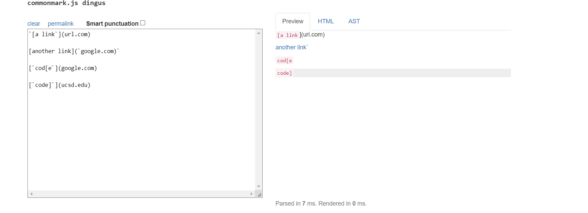
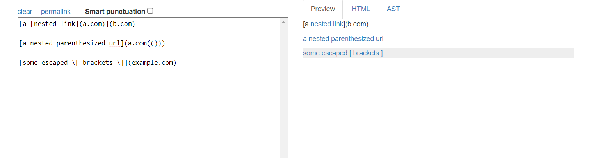
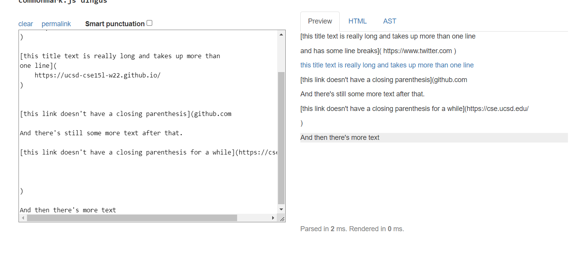
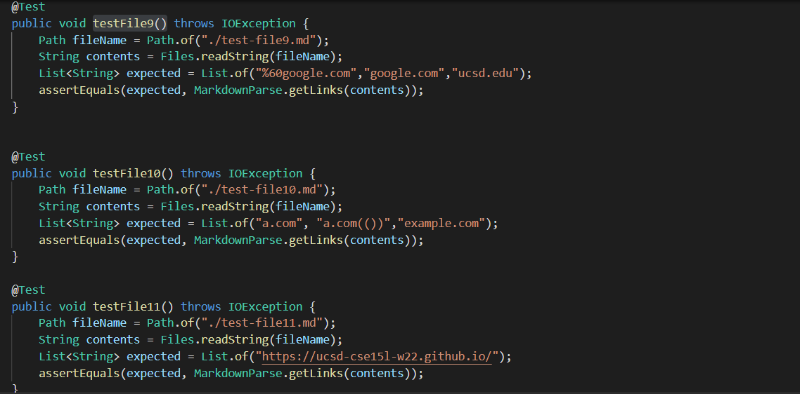
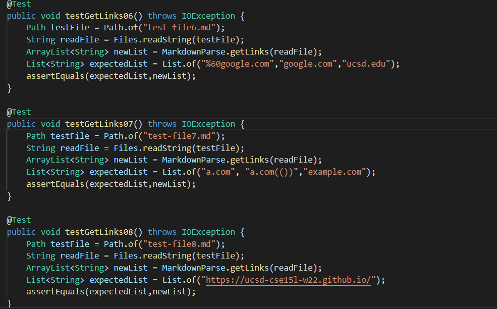
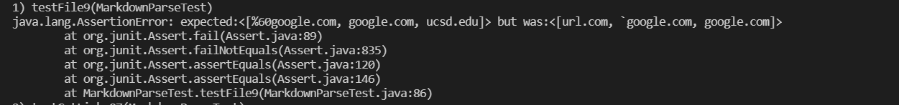
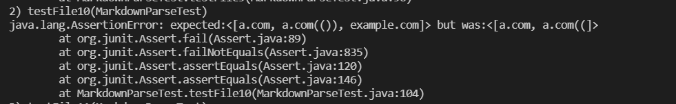
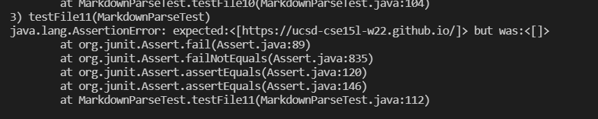

# MarkdownParse Repository Links
[Mine](https://github.com/Andrewphanguyen/CSE15L-Panther.git) 

[Reviewed](https://github.com/annakkin/markdown-parse.git)

# Expected outputs
# Snippet 1

# Snippet 2

# Snippet 3

# Code 

# Mine

# Reviewed

# implementation mine

# implementation Reviewed

