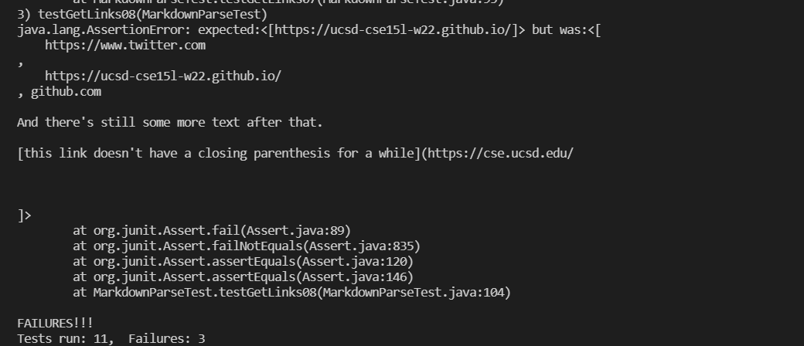

# MarkdownParse Repository Links
[Mine](https://github.com/Andrewphanguyen/CSE15L-Panther.git) 

[Reviewed](https://github.com/annakkin/markdown-parse.git)

# Expected outputs
# Snippet 1

# Snippet 2

# Snippet 3

# Code 

# Mine

# Reviewed

# implementation mine

Didn't pass

Didn't pass

Didn't pass

# implementation review

Didn't pass

Didn't pass

Didn't pass

Do you think there is a small (<10 lines) code change that will make your program work for snippet 1 and all related cases that use inline code with backticks? If yes, describe the code change. If not, describe why it would be a more involved change.

No I don't think so because I feel like in my groups code theres a lot of missing components for it to work properly. Such as when to remove a "(" in the link so I feel theres more changes that need to be made.

Do you think there is a small (<10 lines) code change that will make your program work for snippet 2 and all related cases that nest parentheses, brackets, and escaped brackets? If yes, describe the code change. If not, describe why it would be a more involved change.

No I don't so because for the same reason in snippet 1 my code has a lot of missing components that need to be added in order for the code to work. I feel that what my code needs is a while loop to check if a link is copied correctly that its exactly the same as the one in the test file.

Do you think there is a small (<10 lines) code change that will make your program work for snippet 3 and all related cases that have newlines in brackets and parentheses? If yes, describe the code change. If not, describe why it would be a more involved change.

Yes I think so, I think the change that can be made is have the while loop in my code check for bracket and parenthesis in the link. This way it will check whether the bracket or parenthesis is part of the link or not.
